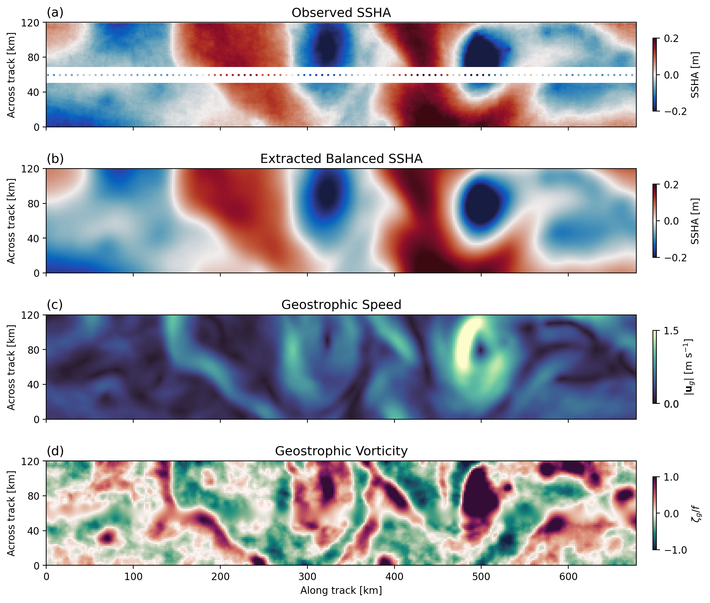

# SWOT Balanced Extraction

This repository provides the workflow for processing, analyzing, and performing the balanced extraction on data from NASA's Surface Water and Ocean Topography (SWOT) mission. 

It includes tools for KaRIn and Nadir data processing, spectral model fitting, Gaussian-process–based balanced SSH extraction, synthetic SWOT data generation, and diagnostics for mesoscale and submesoscale ocean dynamics.

The frontend of the module is in Python and the transforms used for the covariance matrices are performed in Julia for faster processing. 
The Julia transforms are integrated using the `/src/JWS_SWOT_toolbox/julia_bridge.py` which requires the `juliacall` package be installed and the `FFTW, Interpolations, LinearAlgebra, ProgressMeter` packages installed in the connected Julia environment. 

---

## Installation

The installation has now been simplified to a two-part installation: 1) setup a python environment with all required packages and 2) install the required packages into Julia.

### 1.  Python Package Installation

### Create a  Conda Environment for the balanced extraction
Using either `conda` or `mamba` (a faster alternative). Run the following in the main directory to create a balanced extraction `be` conda environment and pull the pre-compiled binaries from `conda-forge`:
```bash
# Create the environment from the script
mamba env create -f src/environment.yml

# Activate the environment
conda activate be
```

This installed the balanced extraction Python module:
```
src/jws_swot_tools/
```

### 2. Julia Installation

For optimal performance, the covariance matrix and Abel transforms are computed using Julia rather than Python. After installing the `be` conda environment above, `juliacall` should install Julia into the conda environment. If this doesn't happen automatically, run one of the python scripts in the main directory and it will prompt the Julia install. After this, the following Julia packages should be installed:
  * `FFTW`
  * `Interpolations`
  * `LinearAlgebra`
  * `ProgressMeter`

by running the following command: 
```
conda activate be
python -c 'import juliapkg; juliapkg.add("FFTW"); juliapkg.add("Interpolations"); juliapkg.add("ProgressMeter"); juliapkg.resolve()'
```

The Python-to-Julia bridge is configured in:
```
/src/jws_swot_tools/julia_bridge.py
```

and the transform functions are called from the Julia script: 
```
/src/jws_swot_tools/transforms_julia.jl
```

---

## Paper and Citation

A full description of the methodology is available in the following paper:

> Skinner, J. W., Callies, J., Lawrence, A., and Zhang, X. (2025). **Isolating Balanced Ocean Dynamics in SWOT Data**. *Submitted to JGR Oceans.*
> [arXiv:2512.03258](https://arxiv.org/abs/2512.03258)



The scripts used to create the figures in the paper are in the folder `balanced_extraction_paper/`.